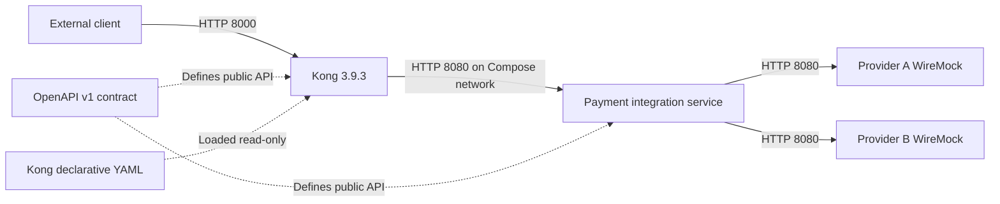

# Container architecture — current state

| Component | Technology; input → output | State held | Not responsible for |
| --- | --- | --- | --- |
| Kong | `kong:3.9.3`, DB-less; public HTTP → proxied canonical HTTP | Declarative entities; per-consumer local rate counters | Canonical validation, idempotency, provider mapping |
| `payment-integration-service` | Java 21, Spring Boot 3.5.16; canonical request → canonical response/error | Payment snapshots, key responses, reference reservations in process | API-key authentication, edge routing, shared persistence |
| Provider A stub | WireMock 3.13.2; `/v1/payments` request → provider A fixture | In-memory request journal | Real settlement or canonical response |
| Provider B stub | WireMock 3.13.2; `/api/payment/create` request → provider B fixture | In-memory request journal | Real settlement or canonical response |
| OpenAPI v1 | YAML in `contracts/payment/v1`; definition → development/test reference | Versioned source file, no runtime process | Applying gateway policy or storing payments |
| Kong config | `gateways/kong/kong.yml`; declarative input → Kong entities at startup/restart | Versioned source file, mounted read-only | Payment business rules |

All four containers join the Compose `partner-bridge` network. Kong reaches backend at `payment-integration-service:8080`; backend reaches `provider-a:8080` and `provider-b:8080`. Host ports are Kong proxy `8000`, Admin API `127.0.0.1:8001`, and stub debug ports `9101`/`9102`. Backend port `8080` is **not** published to the host by default. See [deployment](runtime-deployment.md).

| Concern | Kong | Payment service |
| --- | --- | --- |
| Routing | Owner | Không |
| API key authentication | Owner | Nhận trusted identity |
| Rate limiting | Owner | Không |
| Correlation ID | Tạo/truyền | Log/sử dụng |
| Canonical validation | Không | Owner |
| Idempotency | Không | Owner |
| Provider routing | Không | Owner |
| Provider mapping | Không | Owner |
| Business error | Không | Owner |
| Gateway-generated `401`/`429` | Owner | Không |
| Provider timeout classification | Không | Owner |

Kong giữ nguyên canonical request/response JSON body trong POC. Gateway-generated errors (ví dụ `401`, `429`) là body của Kong, không được ép thành backend `ApiError`; backend-generated status/body đi qua Kong. [ADR-003](adr/ADR-003-gateway-responsibility-boundary.md) giải thích ranh giới này.
