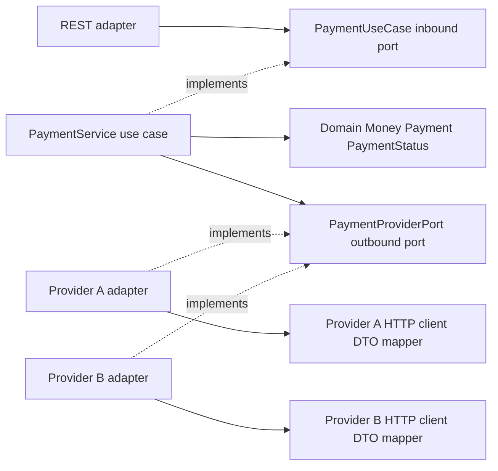
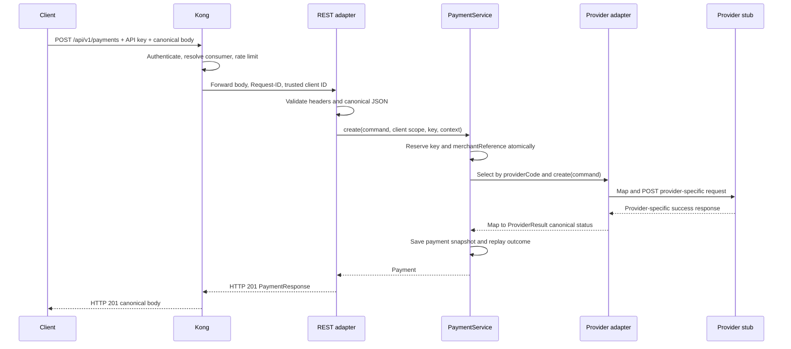
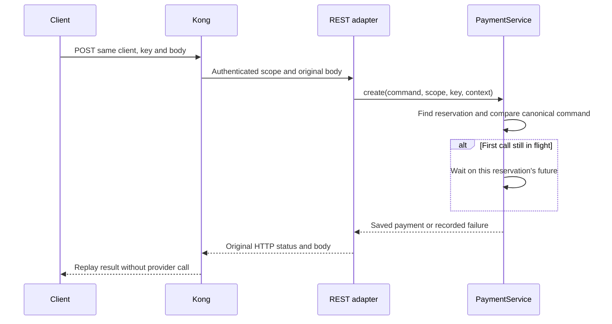
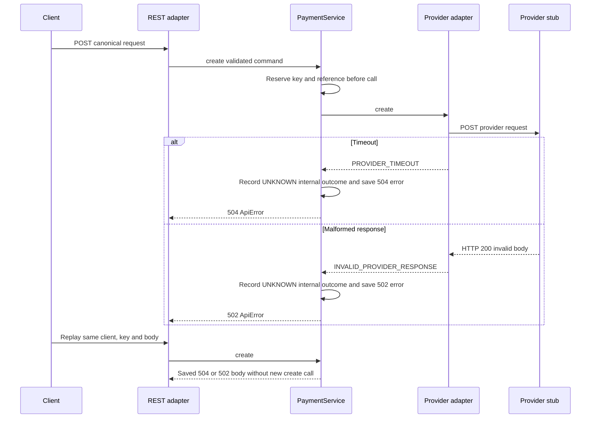
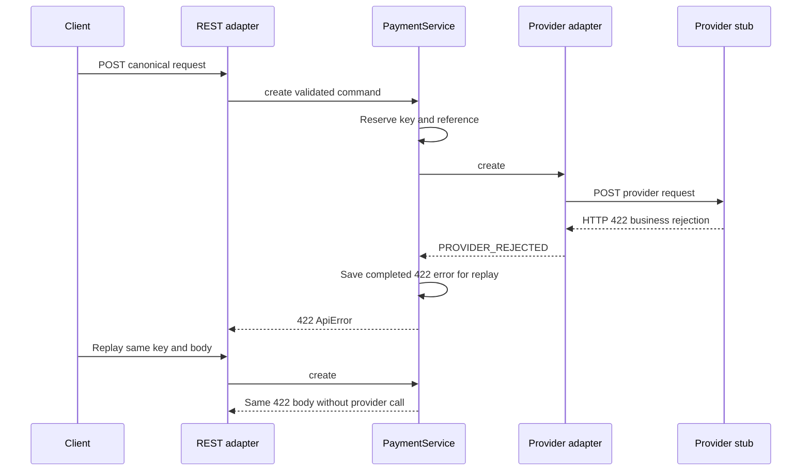

# Payment service architecture — current state

Service là một Maven module được tạo từ HexaForge. Domain/application nằm trong `com.manh.partnerbridge.payment`, không import Spring, HTTP client hoặc provider DTO. Spring wiring ở infrastructure; Kong đứng **ngoài** service, không phải hexagonal layer. Sample Item API vẫn còn trong source nhưng không tham gia các luồng bên dưới.

Mũi tên solid là dependency gọi/sử dụng; mũi tên dashed là implementation interface. Outbound port thuộc application, adapter triển khai port; không có dependency ngược từ application tới adapter. `ProviderResult` trả về status canonical, không đưa provider DTO vào domain.

| Package thực tế dưới `com.manh.partnerbridge.payment` | Vai trò |
| --- | --- |
| `adapter.in.rest` | `PaymentController`, strict JSON deserializer, REST error handler |
| `application.port.in` | `PaymentUseCase` |
| `application.usecase` | `PaymentService`, reservation/replay và provider selection |
| `application.command`, `application.query` | Canonical command/context và recorded failure |
| `application.port.out` | `PaymentProviderPort`, `PaymentMessagesPort` |
| `domain.model`, `domain.exception` | `Money`, `Payment`, `PaymentStatus`, error codes |
| `adapter.out.client.providera` | A adapter, HTTP service interface, request/response records, mapper |
| `adapter.out.client.providerb` | B adapter, HTTP service interface, request/response records, mapper |
| `adapter.out.client.common` | HTTP result/error classification và safe call logging |
| `infrastructure.config`, `infrastructure.config.http` | Bean wiring, typed provider properties, RestClient proxies |
| `infrastructure.i18n`, `infrastructure.error`, `infrastructure.observability` | Localized messages, `ApiError`, request/trace IDs |

`PaymentController` chỉ inject `PaymentUseCase`. Validation bắt `Request-ID`, `Idempotency-Key`, canonical fields và JSON type; `amount.value` phải là string, object không nhận field ngoài schema. Gateway profile yêu cầu `X-Authenticated-Client-Id`; local/direct profile dùng configured `default-id`. `PaymentService` chọn port bằng `providerCode`, giữ payment snapshot và owner scope. `GlobalExceptionHandler` chuyển exception/code thành HTTP `ApiError`; i18n dùng message bundles. Architecture tests chặn controller gọi HTTP client/outbound adapter, và domain/application phụ thuộc framework/adapter.

## A. Create payment thành công

Reservation lock chỉ bao quanh lookup/insert và completion; HTTP call không giữ global lock. `SUCCESS` của stub map thành `SUCCEEDED`, `PENDING` thành `PENDING`. GET đọc snapshot theo payment ID và client scope, **không query provider**.

## B. Replay cùng key và payload

Payload khác với cùng key trả `409`; cùng `merchantReference` với key khác cũng `409`, kể cả lúc first request đang xử lý. Completed replay giữ `201` và `PaymentResponse`; error replay giữ HTTP status và `ApiError` body lần đầu, dù `Request-ID` của lần replay khác. Response header `Request-ID` phản ánh request hiện tại.

## C. Timeout hoặc malformed provider response

`UNKNOWN` là state xử lý nội bộ, **không** phải canonical `PaymentStatus.FAILED`. Không có retry/reconciliation tự động; timeout không chứng minh payment thất bại. Reservation `merchantReference` sống suốt process; response TTL mặc định 24h chỉ bắt đầu khi lần đầu kết thúc và không expire `IN_FLIGHT`.

## D. Business rejection

Stub scenario `FAIL` là business rejection HTTP `422`, không phải `201/FAILED`. `FAILED` chỉ được map khi một **response payment hợp lệ** báo A=`REJECTED` hoặc B=`F`. Bằng chứng: `PaymentServiceTest`, `PaymentApiRegressionTest`, `PaymentProviderAdapterTest` và `ArchitectureTest` trong [service tests](../../services/payment-integration-service/src/test/java/com/manh/partnerbridge/payment/).
