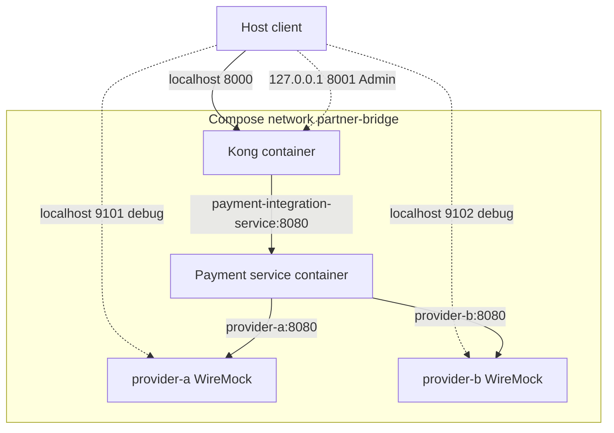

# Runtime deployment — local POC

Deployment được khai báo trong [Compose](../../compose.yaml); Colima có thể cung cấp Docker runtime local, nhưng không là thành phần bắt buộc của kiến trúc ứng dụng. Không có database, message broker hoặc TAD container.

Compose service names là `kong`, `payment-integration-service`, `provider-a`, `provider-b`; container thực tế thường có project prefix do Compose tạo. Proxy `8000` được publish; Admin API chỉ bind host loopback `127.0.0.1:8001`; stub debug ports `9101` và `9102` được publish. Backend `8080` chỉ nằm trong Compose network trong cấu hình mặc định. Port `8443` của image không được publish bởi Compose này. Provider base URLs trong container dùng Docker service names, không dùng `localhost`.

Kong chờ backend healthy; backend chờ hai stubs healthy. Healthcheck: WireMock `/health` mỗi 3s; backend `/actuator/health` mỗi 5s; Kong `kong health` mỗi 5s. Đây là startup ordering/health ở POC, không thay thế readiness/rolling-deployment design. `SPRING_PROFILES_ACTIVE=gateway` bật `trusted-identity-required=true`; thiếu trusted header bị backend từ chối. Local/direct profile giữ default client ID để phát triển riêng.

Các biến quan trọng: `SPRING_PROFILES_ACTIVE`, `PARTNERBRIDGE_PROVIDER_A_BASE_URL`, `PARTNERBRIDGE_PROVIDER_B_BASE_URL`, `PARTNERBRIDGE_PROVIDER_A_API_KEY`, `PARTNERBRIDGE_PROVIDER_B_CLIENT_ID`, `PARTNERBRIDGE_PROVIDER_B_SIGNATURE`, timeout của từng provider, `PARTNERBRIDGE_IDEMPOTENCY_RETENTION` và `PARTNERBRIDGE_CLIENT_DEFAULT_ID`. [Application config](../../services/payment-integration-service/src/main/resources/application.yml) chứa default **dummy local**; không đưa credential production vào file/source. Provider connect/response timeout mặc định `2s`/`3s`; Kong connect/read/write timeout `2s`/`10s`/`10s`, `retries: 0`.

Từ root: `docker compose up -d --build`, `docker compose ps`, chạy [provider smoke](../../provider-stubs/smoke-test.sh) và [gateway smoke](../../scripts/gateway-smoke-test.sh), rồi `docker compose down` khi xong. Gateway smoke tạm dừng/khôi phục backend để thử outage; restart làm mất state payment in-memory. Hướng dẫn vận hành chi tiết ở [gateway README](../../gateways/kong/README.md) và [service README](../../services/payment-integration-service/README.md).
