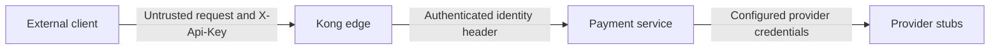

# Security and trust — current POC

**Client → Kong.** Kong `key-auth` chỉ nhận `X-Api-Key` trong header, không trong query/body, và `hide_credentials` không chuyển key client lên backend. Hai consumer local có dummy keys. Thiếu/sai key trả `401`; `rate-limiting` trả `429` với counter local theo consumer. Đây là POC authentication, không phải authorization policy đầy đủ.

**Kong → backend.** Sau authentication, `request-transformer` xóa `X-Authenticated-Client-Id` và `X-Client-Id` do caller gửi, rồi thêm `X-Authenticated-Client-Id` từ `X-Consumer-Custom-ID` của Kong. Gateway smoke thử spoof cả các header này. Backend gateway profile bắt buộc trusted header; tạo payment và GET đều dùng scope đó. GET của consumer khác trả `404`. Cơ chế trust dựa vào Compose network và Kong là ingress mặc định; backend chưa có mTLS hay cryptographic proof cho internal header. Nếu backend bị expose trực tiếp hoặc host trong network không tin cậy, header có thể bị giả mạo.

**Correlation.** Kong `correlation-id` dùng `Request-ID`, tạo khi caller thiếu và echo downstream. Backend `RequestIdFilter` giữ/echo ID, gắn MDC; controller yêu cầu ID hợp lệ theo canonical contract. Provider adapter chuyển ID sang stub. Header của replay phản ánh request hiện tại, còn error body lưu có request/trace/time của lần đầu. Đây là correlation, không phải cơ chế authentication.

**Backend → provider.** Provider A dùng configured API key; B dùng configured client ID/signature. `ProviderHttpClientConfiguration` bind properties/environment và truyền qua provider-specific HTTP interfaces. `ProviderCallSupport` log provider, request ID, duration, `callOutcome` và `paymentStatus`, không log credential hay raw provider response. Stub B chỉ kiểm tra dạng signature, không xác minh HMAC thật. Default values trong local config là dữ liệu giả, không được dùng như secret production.

Kong Admin API chỉ bind `127.0.0.1:8001` trên host theo Compose; DB-less không hỗ trợ CRUD entity qua Admin API. POC **chưa có** TLS/mTLS, secret manager, OAuth2/JWT/JWS, certificate rotation, centralized audit, production network policy hoặc trust mechanism giữa Kong và backend phù hợp production. Xem [limitations](limitations-and-roadmap.md).
