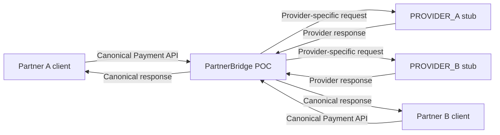

# System context — current state

Partner A và Partner B là hai consumer local có API key riêng trong Kong; ứng dụng/client của họ gọi cùng canonical Payment API. Chúng **không** phải `PROVIDER_A`/`PROVIDER_B`: hai mã sau là lựa chọn payment provider logic trong request. Client không thấy endpoint, credential, payload hoặc status riêng của provider; backend trả `PaymentResponse`/`ApiError` canonical.

Current API có `POST /api/v1/payments` và `GET /api/v1/payments/{paymentId}`. `providerCode` chỉ nhận `PROVIDER_A` hoặc `PROVIDER_B`; amount canonical dùng string. `SUCCEEDED`, `PENDING`, `FAILED` là canonical status; stub scenario `SUCCESS`/`FAIL` không phải enum public. Xem [contract](../../contracts/payment/v1/README.md).

TAD CLI là đối tượng [nghiên cứu](../tad-evaluation.md), không phải runtime component hay gateway connector hiện tại. Core, Way4 và IBFT cũng chưa tích hợp; chúng chỉ được nhắc trong [roadmap](limitations-and-roadmap.md), không xuất hiện trong current-state diagram.
