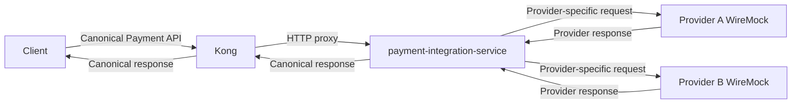
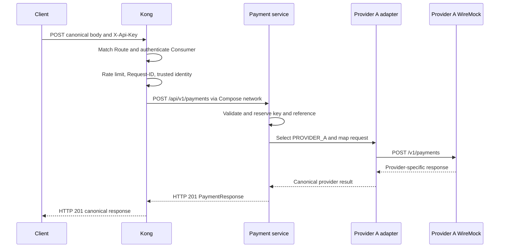

# Kong trong PartnerBridge?

Làm quen API Gateway (cổng nhận request trước backend). Yêu cầu nắm được:

- Lần theo request từ client tới provider stub.
- Phân biệt Kong Service với Java service.
- Giới thiệu Route, Consumer, Credential và Plugin.
- Các header nào Kong xử lý hoặc chuyển tiếp.
- Hiểu vì sao file YAML đủ để Kong chạy.
- Kiểm tra cấu hình đã load.

Đây là **local POC**, không phải hướng dẫn triển khai production.

## Overview



Client gọi `POST /api/v1/payments` hoặc `GET /api/v1/payments/{paymentId}` qua Kong. Kong **không** gọi provider stub.
Java payment service đọc `providerCode`, chọn adapter `PROVIDER_A` hoặc `PROVIDER_B`, chuyển payload riêng và chuẩn hóa
kết quả về [canonical contract](../../contracts/payment/v1/openapi.yaml) trước khi trả qua Kong. Hai provider hiện là
WireMock containers, không phải dịch vụ thanh toán thật.

## Ví dụ

Gateway là quầy bảo vệ

| Thành phần           | Ví dụ                    |
|----------------------|--------------------------|
| Kong                 | Quầy bảo vệ              |
| Route                | Bảng hướng dẫn phòng ban |
| Kong Service         | Địa chỉ phòng ban        |
| Consumer             | Danh tính khách          |
| API key / Credential | Thẻ ra vào               |
| Plugin               | Quy định bảo vệ          |
| Payment service      | Phòng xử lý thanh toán   |
| Provider stub        | Đơn vị bên ngoài         |
| `kong.yml`           | Sổ quy trình của bảo vệ  |

Khách (client) đến quầy Kong.
Bảo vệ nhìn đường dẫn và phương thức để chọn Route, kiểm tra thẻ `X-Api-Key` bằng plugin `key-auth`, rồi nhận ra
Consumer `partner-a` hoặc `partner-b`.
Các plugin khác giới hạn số lượt, xử lý `Request-ID` và
lập phiếu danh tính nội bộ `X-Authenticated-Client-Id`.
Kong chuyển request đến địa chỉ phòng ban do Kong Service định
nghĩa.
Phòng thanh toán (`payment-integration-service`) tự đọc `providerCode` và chọn provider stub;
Bảo vệ không quyết định việc đó.

## Vì sao chỉ cần YAML?

Kong Docker image `kong:3.9.3` đã chứa logic reverse proxy (nhận và chuyển tiếp HTTP) và các plugin `key-auth`,
`rate-limiting`, `correlation-id`, `request-transformer`. [kong.yml](../../gateways/kong/kong.yml) chỉ khai báo entity (
đối tượng cấu hình) và bật/cấu hình plugin; nó không chứa thuật toán xác thực hay rate limit. Giống như đội bảo vệ đã
được đào tạo là Kong image, còn sổ quy trình của tòa nhà là `kong.yml`.

Compose đặt `KONG_DATABASE=off`, mount YAML read-only và khai báo `KONG_DECLARATIVE_CONFIG=/etc/kong/kong.yml`. Khi khởi
động, Kong parse/validate file và load Service, Route, Consumer, Credential, Plugin vào state trong memory. Mỗi request
dùng state đó; Kong không đọc và diễn giải lại toàn bộ YAML cho từng request. Trong DB-less POC này, YAML là source of
truth.

## Các khái niệm trong `kong.yml`

**Kong Service** là entity mô tả upstream (đích proxy), **không phải** process/container mới. Service này trỏ tới Java
service đã có:

```yaml
services:
  - name: payment-integration-service
    url: http://payment-integration-service:8080
    connect_timeout: 2000
    read_timeout: 10000
    write_timeout: 10000
    retries: 0
```

`url` là upstream URL. Các timeout ở đây tính bằng mili giây: tối đa 2 giây để kết nối, 10 giây chờ đọc và 10 giây khi
ghi. `retries: 0` tránh để Kong tự gọi lại payment create. Backend provider timeout mặc định 3 giây, ngắn hơn Kong read
timeout.

**Route** là quy tắc match request vào Service. Route thực tế tên `canonical-payment-v1`:

```yaml
routes:
  - name: canonical-payment-v1
    paths:
      - /api/v1/payments
    methods:
      - GET
      - POST
    strip_path: false
    preserve_host: false
```

`strip_path: false` giữ nguyên `/api/v1/payments` khi proxy; backend vẫn nhận canonical path. `preserve_host: false` để
upstream dùng host của Service. Route này bao gồm `GET /api/v1/payments/{paymentId}` theo cấu hình Kong hiện tại.

**Consumer** là danh tính gọi API mà Kong biết sau khi xác thực, khác với payment provider. Hai consumer là `partner-a`
và `partner-b`, với `custom_id` tương ứng. **Credential** là thẻ ra vào gắn với Consumer, ở đây là
`keyauth_credentials`. Ví dụ từ YAML:

```yaml
consumers:
  - username: partner-a
    custom_id: partner-a
    keyauth_credentials:
      - key: local-poc-partner-a-key
```

`local-poc-partner-a-key` là **dummy credential.

**Plugin** là quy định chạy tại gateway. Cấu hình hiện tại bật `key-auth`, `rate-limiting`, `correlation-id` và
`request-transformer` cho Route. Ví dụ:

```yaml
plugins:
  - name: key-auth
    route: canonical-payment-v1
    config:
      key_names:
        - X-Api-Key
      key_in_header: true
      key_in_query: false
      key_in_body: false
      hide_credentials: true
```

Kong chỉ nhận API key trong header và không chuyển credential đó xuống backend. Rate limit hiện là 60 request/phút theo
Consumer với counter local. Plugin khác tạo/truyền correlation ID và bảo vệ trusted identity.

## Header có phải đăng ký với Kong không?

**Không. Header HTTP thông thường được proxy xuống backend theo mặc định.** Chỉ header cần Kong xử lý, tạo, xóa hoặc
biến đổi mới cần policy cấu hình riêng.

| Nhóm                            | Header thực tế                                       | Hành vi                                                                                                                                    |
|---------------------------------|------------------------------------------------------|--------------------------------------------------------------------------------------------------------------------------------------------|
| Gateway-consumed                | `X-Api-Key`                                          | `key-auth` đọc, xác thực và ẩn khỏi upstream (`hide_credentials: true`).                                                                   |
| Business / pass-through         | `Idempotency-Key`, `Content-Type`, `Accept-Language` | Chuyển xuống backend; Kong không cần “đăng ký” chúng. Backend dùng key để replay, content type để đọc JSON và language cho message.        |
| Gateway-generated / correlation | `Request-ID`, `X-Consumer-Custom-ID`                 | `correlation-id` tạo `Request-ID` nếu thiếu, giữ/echo ID được cung cấp; Kong có consumer identity sau key-auth.                            |
| Protected / internal            | `X-Authenticated-Client-Id`                          | `request-transformer` xóa giá trị do client gửi và tạo lại từ `X-Consumer-Custom-ID` đã xác thực. Nó cũng xóa `X-Client-Id` do client gửi. |

Canonical contract yêu cầu `Request-ID` trên cả POST/GET và `Idempotency-Key` trên POST. Nếu client thiếu `Request-ID`,
Kong POC tạo ID trước khi request đến backend; gọi backend trực tiếp vẫn phải tuân thủ yêu cầu của controller.
`Request-ID` là correlation, **không** thay thế idempotency key.

## Một request đi qua hệ thống thế nào?

Ví dụ local dùng dummy credential đã commit trong `kong.yml`. Dùng reference/key mới nếu chạy lại vì backend giữ
idempotency trong memory:

```bash
curl -i http://localhost:8000/api/v1/payments \
  -H 'X-Api-Key: local-poc-partner-a-key' \
  -H 'Request-ID: onboarding-req-001' \
  -H 'Idempotency-Key: onboarding-idem-001' \
  -H 'Content-Type: application/json' \
  -d '{"providerCode":"PROVIDER_A","merchantReference":"ORDER-SUCCESS-ONBOARDING-001","amount":{"value":"100000","currency":"VND"},"description":"Local fake payment"}'
```

`SUCCESS` trong reference là fixture của stub; canonical response dùng status `SUCCEEDED`, không dùng `SUCCESS`. Kết quả
create thành công trả HTTP `201` với `PaymentResponse` canonical.

Theo **luồng logic**:
(1) client gọi proxy `8000`;
(2) Kong match Route;
(3) `key-auth` kiểm key;
(4) resolve Consumer;
(5) kiểm quota;
(6) xử lý `Request-ID`;
(7) ghi trusted identity;
(8) proxy qua Docker network;
(9) backend validate canonical request và reserve idempotency;
(10) backend chọn provider;
(11) adapter map request;
(12) WireMock
trả response;
(13) backend map canonical result;
(14) Kong trả status/body cho client. Thứ tự thực thi plugin thực tế do
Kong quyết định; danh sách này mô tả trách nhiệm, không là plugin priority specification.



Nếu `providerCode=PROVIDER_B`, service chọn B adapter và gọi `/api/payment/create` trên `provider-b:8080`. Không phải
Kong đổi route theo provider.

## Vì sao client không tự ghi trusted identity?

Khách tự viết “tôi là Partner B” trên giấy không có giá trị. Bảo vệ phải bỏ tờ giấy đó và tạo phiếu nội bộ từ thẻ đã xác
thực. Trong HTTP, `X-Authenticated-Client-Id` do client gửi là **untrusted**. `request-transformer` xóa header này và
`X-Client-Id`, rồi thêm `X-Authenticated-Client-Id:$(headers["X-Consumer-Custom-ID"])` từ Consumer mà `key-auth` đã xác
thực. Gateway smoke test gửi header giả và kiểm tra scope không bị đổi.

Backend chạy Spring profile `gateway`, đặt `partnerbridge.client.trusted-identity-required=true`. `PaymentController`
yêu cầu trusted header cho POST và GET, dùng nó làm client scope; thiếu/không hợp lệ trả `400` thay vì fallback
`local-poc-client`. GET payment thuộc consumer khác trả `404`. POC chưa có mTLS hoặc bằng chứng mật mã giữa Kong và
backend; không được expose backend trực tiếp cho client không tin cậy.

## Docker networking: `localhost` là của ai?

Host gọi `http://localhost:8000` để vào Kong, `http://127.0.0.1:8001` để inspect Admin API; stub debug ports là
`localhost:9101` và `localhost:9102`. Bên trong container, `localhost` chỉ chính container đó, **không phải máy Mac hay
container khác**. Kong gọi `http://payment-integration-service:8080`; backend gọi `http://provider-a:8080` hoặc
`http://provider-b:8080`. Các tên này là Docker Compose service names trong network `partner-bridge`. Backend `8080`
không được publish ra host trong Compose mặc định.

## DB-less và reload

DB-less nghĩa là `KONG_DATABASE=off`; `kong.yml` mount read-only là declarative source of truth. Admin API cho phép GET
để inspect entity đã load, nhưng entity CRUD qua Admin API không dùng được: thử POST tạo Service trong Step 7 trả HTTP
`405`. Sửa YAML trên host **không** làm Kong runtime tự cập nhật. POC dùng `docker compose restart kong` để load lại
file; sau đó kiểm tra Admin GET và smoke test. Không cần chuyển sang database mode.

## Ai chịu trách nhiệm việc gì?

| Concern                | Kong                   | Payment service          |
|------------------------|------------------------|--------------------------|
| Routing vào backend    | Có                     | Không                    |
| API-key authentication | Có                     | Không                    |
| Consumer identity      | Tạo từ key đã xác thực | Sử dụng làm client scope |
| Rate limiting          | Có                     | Không                    |
| Correlation ID         | Tạo/truyền             | Log/truyền tiếp          |
| Canonical validation   | Không                  | Có                       |
| Idempotency            | Không                  | Có                       |
| Chọn provider          | Không                  | Có                       |
| Provider mapping       | Không                  | Có                       |
| Business error         | Không                  | Có                       |

Kong-generated `401`/`429` không nhất thiết có body canonical `ApiError`. Backend tạo business/provider errors như
`422`, `502`, `504`; Kong giữ nguyên status/body backend. Chi tiết boundary
ở [ADR-003](../architecture/adr/ADR-003-gateway-responsibility-boundary.md).

## Cách quan sát Kong

Chạy từ root repository sau `docker compose up -d --build`. Các lệnh GET chỉ đọc state; không cần `jq` (có thể pipe vào
`jq` nếu đã cài):

```bash
docker compose ps
docker compose logs --tail=50 kong
curl -i http://127.0.0.1:8001/services
curl -i http://127.0.0.1:8001/routes
curl -i http://127.0.0.1:8001/plugins
curl -i http://127.0.0.1:8001/consumers
curl -i http://localhost:8000/api/v1/payments/00000000-0000-0000-0000-000000000000 \
  -H 'Request-ID: onboarding-no-key'
curl -i http://localhost:8000/api/v1/payments/00000000-0000-0000-0000-000000000000 \
  -H 'X-Api-Key: local-poc-partner-a-key' -H 'Request-ID: onboarding-valid-key'
```

GET thiếu key dự kiến `401`; GET với dummy key hợp lệ nhưng payment ID không tồn tại dự kiến `404`. Xem `Request-ID` ở
response và `docker compose logs --tail=100 payment-integration-service` cho request đã tới backend. Muốn biết provider
nào nhận create, xem `providerCode` trong request và WireMock request journal ở `http://localhost:9101/__admin/requests`
hoặc `http://localhost:9102/__admin/requests`; đây là debug API local, không phải production telemetry.

## Những hiểu nhầm thường gặp

| Hiểu nhầm                                    | Thực tế trong POC                                                                         |
|----------------------------------------------|-------------------------------------------------------------------------------------------|
| Mọi header đều phải “đăng ký” với Kong       | Header thường được proxy; chỉ header có policy riêng cần cấu hình.                        |
| Kong chọn Provider A/B                       | `PaymentService` chọn theo `providerCode`; Kong chỉ route tới backend.                    |
| Kong Service là microservice mới             | Nó là entity địa chỉ upstream, trỏ tới Java service container sẵn có.                     |
| YAML tự chứa logic authentication            | Kong image chứa logic plugin; YAML chỉ khai báo/bật và cấu hình.                          |
| Sửa `kong.yml` là runtime tự cập nhật        | POC cần `docker compose restart kong` để load lại.                                        |
| `localhost` trong container trỏ về máy Mac   | Nó trỏ về chính container; dùng Docker service name để gọi container khác.                |
| Kong chuẩn hóa business response             | Backend mapping và tạo canonical body; Kong proxy body đó.                                |
| TAD `packages/api/gateway` là Kong connector | Đó là RPC nội bộ TAD; [Step 7 evaluation](../tad-evaluation.md) chưa thấy Kong connector. |

## Checklist

- [ ] Nếu dùng Colima, chạy `colima start`; sau đó `docker compose up -d --build` từ root.
- [ ] `docker compose ps` báo `kong`, `payment-integration-service`, `provider-a`, `provider-b` healthy.
- [ ] GET qua proxy thiếu `X-Api-Key` trả `401`.
- [ ] Gọi POST canonical bằng dummy key local; thấy `201` và `status: SUCCEEDED` cho fixture `SUCCESS`.
- [ ] Tìm cùng `Request-ID` ở response và log backend.
- [ ] Đọc `providerCode` và xác nhận request journal của A hoặc B nhận call.
- [ ] GET Admin API `services`, `routes`, `plugins`, `consumers` để thấy config đã load.
- [ ] Giải thích vì sao backend chỉ có network port `8080`, không có host port mặc định.
